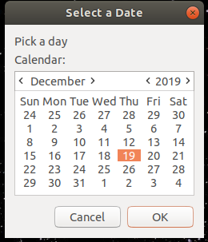
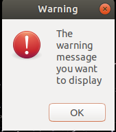
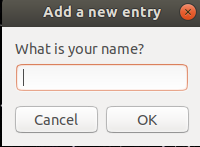
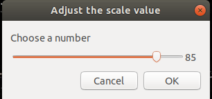

# dialog-box
<p align="left">
  <a href="https://travis-ci.org/pankajchaudhary5/dialog-box">
    
  </a>
  <a href="https://crates.io/crates/dialog-box">
    
  </a>
  
  
</p>

A Rust Crate/Library by which we can use different Dialog-box in rust program to display warning, information, or error. We can also take input from various dialog-box like calender, question, file path.

 





## Use
Add dependency in Cargo.toml
```sh
[dependencies]
dialog_box = "0.1.0"
```
Example to use dialog-box crate
```sh
extern crate dialog_box;
use dialog_box::{calender, warning};

fn main() {
    println!("{}", calender("Select a Date"));
    println!("{}", warning("The warning message you want to display"));
}
```
## Contributing
We thrive for the best and want you to contribute towards a better Project. See [`CONTRIBUTING.md`](CONTRIBUTING.md) for giving your valuable feedbacks and contributions.